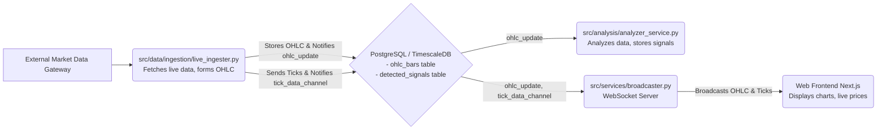

# ProjectX Mechanical Trading System

This project implements a mechanical trading system that ingests live market data, performs analysis to detect trading signals, and displays this information on a web interface.

## Quick Start / TL;DR

Want to get a feel for the system quickly on your local machine?

1.  **Setup**: Clone, install Python/Node deps, copy `.env.template` to `.env` & fill it (API keys, DB pass).
2.  **Database**: Run `./run_timescaledb_docker.sh`.
3.  **Backend**: Start broadcaster (`python src/services/broadcaster.py`), then run `./run_services.sh`.
4.  **Frontend**: `cd web && npm run dev`. Open `http://localhost:3000`.

(For detailed steps, see [Setup and Running the System](#setup-and-running-the-system).)

## Core Architecture

The system features Python backend services for data ingestion and analysis, a PostgreSQL/TimescaleDB database, and a Next.js web frontend. Live market data is processed, stored, and then broadcast via WebSockets for real-time chart visualization.



*(Diagram shows data flow: Gateway -> Ingester -> Database -> Analyzer & Broadcaster -> Frontend)*

## Components

### 1. Backend Services (Python)

Located primarily under the `src/` directory.

#### a. Live Ingester (`src/data/ingestion/live_ingester.py`)
   - **Purpose**: Connects to an external market data gateway (e.g., TopstepX) to receive live trade and quote data for configured financial contracts.
   - **Key Functionality**:
     - Aggregates raw tick data into OHLC (Open, High, Low, Close) bars for various timeframes (e.g., 1m, 5m, 1h).
     - Stores these OHLC bars into the `ohlc_bars` table in the TimescaleDB database.
     - Upon storing a new/updated OHLC bar, it sends a PostgreSQL `NOTIFY` on the `ohlc_update` channel with bar details.
     - Sends raw tick data via PostgreSQL `NOTIFY` on the `tick_data_channel`.
   - **Key Configuration**:
     - Contract IDs and target timeframes via `config/settings.yaml` (under `live_contracts` within the `trading` section).
     - Credentials and API endpoint details via `.env` and `config/settings.yaml`.

#### b. Analyzer Service (`src/analysis/analyzer_service.py`)
   - **Purpose**: Performs trend analysis and signal detection based on incoming market data.
   - **Key Functionality**:
     - Listens for `ohlc_update` notifications from the database (sent by `live_ingester.py`).
     - When a new OHLC bar is available for a configured contract and timeframe, it fetches relevant historical data from the `ohlc_bars` table.
     - Runs one or more analysis strategies (e.g., `cus_cds_trend_finder` located in `src/strategy/`) on the data.
     - Stores any detected trading signals (e.g., trend starts) into the `detected_signals` table in the database (creates the table if it doesn't exist, based on its DDL).
   - **Key Configuration**: Analysis targets (contract, timeframe, strategy ID) are defined in `config/settings.yaml` (under `analysis.targets`).

#### c. Broadcaster Service (`src/services/broadcaster.py`)
   - **Purpose**: Provides real-time data to the web frontend via WebSockets.
   - **Key Functionality**:
     - Connects to the PostgreSQL database and `LISTEN`s for notifications on two channels:
       - `ohlc_update`: For completed OHLC bars (sent by `live_ingester.py`).
       - `tick_data_channel`: For raw tick-by-tick price updates (sent by `live_ingester.py`).
     - When a notification is received, it broadcasts the JSON payload to all connected WebSocket clients (i.e., instances of the web frontend).
     - Starts a WebSocket server (default: `ws://localhost:8765`).
   - **Key Configuration**: Database connection details are loaded from `.env`. WebSocket host/port can be set via environment variables (`WEBSOCKET_HOST`, `WEBSOCKET_PORT`).

#### d. Configuration (`src/core/config.py` & `config/settings.yaml`)
   - **Purpose**: Manages system-wide settings and provides a unified configuration interface.
   - **Key Components**:
     - `config/settings.yaml`: Central YAML file for defining parameters for various services, including API endpoints, database connections (templates), trading contract lists, timeframes for analysis and ingestion, and parameters for specific analysis strategies.
     - `src/core/config.py`: Python class (`Config`) responsible for loading `settings.yaml` and environment variables (from `.env`) to provide configuration access to all Python services.
     - `.env`: Stores sensitive information like API keys and database passwords. A `.env.template` is provided as a guide.

#### e. Database Interaction (`src/data/storage/db_handler.py`, `scripts/setup_local_db.py`)
   - **Purpose**: Handles direct communication with PostgreSQL/TimescaleDB and initial schema setup.
   - **Key Functionality**:
     - `db_handler.py`: Provides utility functions for getting database connections.
     - Python services (like `analyzer_service.py` and `live_ingester.py`) often contain DDL for creating their necessary tables (e.g., `detected_signals`, `ohlc_bars`) if they don't exist on startup.
     - `scripts/setup_local_db.py`: While services can create tables, this script (if used) can perform more comprehensive initial database setup, including creating the `ohlc_bars` table as a TimescaleDB hypertable.
   - **Note**: The system is designed for TimescaleDB to leverage its time-series data handling capabilities, especially for `ohlc_bars`.

### 2. Web Frontend (Next.js)

Located under the `web/` directory.

#### a. Main Application (`web/src/app/`)
   - **Purpose**: Provides the user interface for viewing market data and trading signals.
   - **Technology**: A Next.js application using React and TypeScript.

#### b. Trends Page (`web/src/app/trends/page.tsx`)
   - **Purpose**: Displays interactive candlestick charts with OHLC data and detected trend signals.
   - **Key Functionality**:
     - Fetches historical OHLC data and trend signals from backend API endpoints (e.g., `/api/ohlc`, `/api/trend-starts`).
     - Establishes a WebSocket connection to the `broadcaster.py` service (default: `ws://localhost:8765`).
     - Listens for messages from the WebSocket:
       - **Tick messages**: Updates the currently forming (last) candlestick on the chart in real-time.
       - **OHLC messages**: Updates completed candlesticks on the chart if the message's timeframe matches the selected chart timeframe.
     - Uses the Lightweight Charts™ library for rendering charts.
     - Allows users to select different contracts and timeframes to view.

#### c. API Routes (`web/src/app/api/`)
   - **Purpose**: Backend API endpoints for the Next.js application, built using Next.js API Routes.
   - **Key Routes**:
     - `/api/ohlc`: Fetches historical OHLC data from the database.
     - `/api/trend-starts`: Fetches detected trend signals (from `detected_signals` table) from the database.
   - **Database Interaction**: These routes use Prisma ORM for database queries.

#### d. Prisma (`web/prisma/schema.prisma` & `web/src/lib/prisma.ts`)
   - **Purpose**: Database access layer for the Next.js backend.
   - **Key Components**:
     - `web/prisma/schema.prisma`: Defines the database schema from the web application's perspective. Note that the Python services manage the actual DDL for `ohlc_bars` and `detected_signals`.
     - `web/src/lib/prisma.ts`: Provides the centralized Prisma Client, a type-safe database client used by the API routes.

### 3. Database (PostgreSQL with TimescaleDB)

- **Purpose**: Central data store for the system.
- **Key Tables**:
    - `ohlc_bars`: Stores OHLC data for various contracts and timeframes. Populated by `live_ingester.py`. Intended to be a TimescaleDB hypertable for efficiency.
    - `detected_signals`: Stores trading signals generated by `analyzer_service.py`.
- **Real-time Mechanism**: Utilizes PostgreSQL's `LISTEN`/`NOTIFY` mechanism for efficient, real-time communication between backend services.

### 4. Scripts & Utilities

#### a. Historical Data Downloader (`download_historical.py`)
   - **Purpose**: A utility script to download and backfill historical OHLC data for specified contracts and timeframes.
   - **Usefulness**: Essential for populating the database with historical data before live trading begins or for backtesting trading strategies.

#### b. Service Runner (`run_services.sh`)
   - **Purpose**: A shell script to conveniently start the core backend Python services (`live_ingester.py` in the background and `analyzer_service.py` in the foreground).
   - **Note**: `broadcaster.py` is typically run as a separate, independent process.

#### c. Docker (`Dockerfile`, `run_timescaledb_docker.sh`)
   - **Purpose**: Containerization for deployment and development.
     - `Dockerfile`: For containerizing the Python backend services, intended for deployment environments (e.g., Railway).
     - `run_timescaledb_docker.sh`: Script to easily run a local TimescaleDB instance in Docker for development and testing.

## Setup and Running the System

Follow these steps to get the system running locally:

1.  **Environment Setup**:
    - Clone this repository.
    - Install Python dependencies: `pip install -r requirements.txt`
    - Install Node.js dependencies: `cd web && npm install`
    - Create your `.env` file by copying `.env.template`. Update it with your actual API keys, database password, and any other environment-specific settings.

2.  **Database Setup**:
    - Ensure Docker is running on your system.
    - Make the script executable: `chmod +x run_timescaledb_docker.sh`
    - Start a local TimescaleDB instance: `./run_timescaledb_docker.sh`
    - **Table Creation**:
        - The `ohlc_bars` table (as a hypertable) and `detected_signals` table are critical.
        - Python services (`live_ingester.py`, `analyzer_service.py`) are designed to create these tables with basic structure if they don't exist on their first run.
        - For a more controlled setup, especially for ensuring `ohlc_bars` is a hypertable, you might use `scripts/setup_local_db.py` (if you choose to run it manually after the DB is up).

3.  **Download Historical Data (Recommended)**:
    - To populate your database for testing and analysis:
      `python download_historical.py --contracts "CON.F.US.MES.M25" --start-date "YYYY-MM-DD" --end-date "YYYY-MM-DD"`
    - (Adjust contract, dates, and desired timeframes. Use `python download_historical.py --help` for more options).

4.  **Run Backend Services**:
    - Make the script executable: `chmod +x run_services.sh`
    - **Terminal 1 (Broadcaster)**: `python src/services/broadcaster.py`
    - **Terminal 2 (Ingester & Analyzer)**: `./run_services.sh`

5.  **Run Frontend Application**:
    - **Terminal 3 (Web App)**:
      ```bash
      cd web
      npm run dev
      ```
    - Open your browser to `http://localhost:3000` (or the port shown in the terminal).

## Data Flow for Live Chart Updates

1.  `live_ingester.py` receives a raw tick from the market data gateway.
2.  It immediately sends this tick data via `NOTIFY tick_data_channel` in PostgreSQL.
3.  It also aggregates ticks into OHLC bars. When a bar for a configured timeframe (e.g., 1m) is complete, it's stored in the `ohlc_bars` table, and a `NOTIFY ohlc_update` is sent with the bar data.
4.  `broadcaster.py` is listening on both `tick_data_channel` and `ohlc_update`.
5.  When `broadcaster.py` receives a notification, it forwards the JSON payload via WebSocket to all connected web clients.
6.  The `TrendsPage` in the web frontend receives the WebSocket message:
    - If it's a 'tick' message, it updates the high/low/close of the *currently forming* candlestick on the chart for the selected timeframe.
    - If it's an 'ohlc' message and its timeframe matches the chart's selected timeframe, it draws/updates the completed candlestick.
7.  Separately, `analyzer_service.py` also listens for `ohlc_update`. When it receives one, it processes the new bar, runs analysis, and may store new signals in `detected_signals`. The frontend can fetch these signals via its API routes.

## Troubleshooting (Placeholder)

- *Port conflicts for services (broadcaster, web app, database)...*
- *Database connection issues (check `.env`, Docker logs)...*
- *API key or token problems for data ingestion...*

---

This README provides a comprehensive overview. You can expand on specific sections, add more detailed setup instructions, or include information about deployment as the project evolves.

