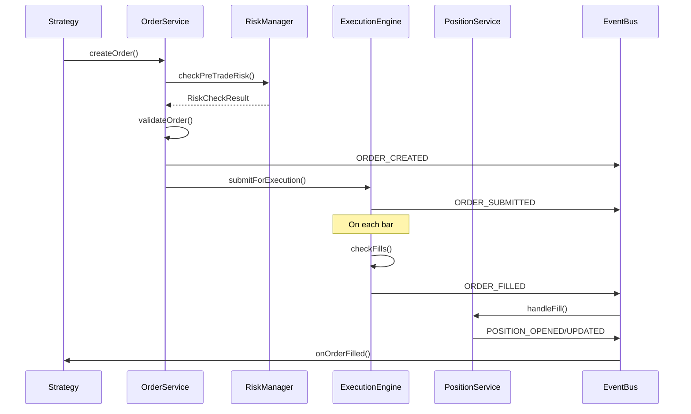

# Order Management System Architecture

## Overview

The new order management system is designed with separation of concerns, event-driven architecture, and extensibility in mind. It replaces the monolithic OrderManager with a modular system of specialized services.

## Core Principles

1. **Separation of Concerns**: Each service has a single responsibility
2. **Event-Driven**: All state changes emit events for reactive updates
3. **Immutability**: Orders and positions are immutable; changes create new versions
4. **Testability**: Each component can be tested in isolation
5. **Extensibility**: New order types and execution models can be added easily

## Architecture Components

### 1. Order Service (`OrderService`)

Responsible for order lifecycle management.

```typescript
interface IOrderService {
  createOrder(request: OrderRequest): Order;
  submitOrder(order: Order): Promise<OrderSubmissionResult>;
  cancelOrder(orderId: string): Promise<CancellationResult>;
  modifyOrder(orderId: string, modifications: OrderModification): Promise<Order>;
  getOrder(orderId: string): Order | null;
  getOrders(filter?: OrderFilter): Order[];
}
```

**Subcomponents:**
- `OrderFactory`: Creates different order types (Market, Limit, Stop, OCO, Bracket)
- `OrderValidator`: Validates orders before submission
- `OrderRepository`: Stores and retrieves orders
- `OrderEventEmitter`: Publishes order lifecycle events

### 2. Position Service (`PositionService`)

Manages position tracking and P&L calculations.

```typescript
interface IPositionService {
  openPosition(fill: Fill): Position;
  updatePosition(positionId: string, fill: Fill): Position;
  closePosition(positionId: string, fill: Fill): ClosedPosition;
  getPosition(positionId: string): Position | null;
  getPositions(filter?: PositionFilter): Position[];
  calculateUnrealizedPnL(position: Position, currentPrice: number): number;
}
```

**Subcomponents:**
- `PositionTracker`: Tracks open positions
- `PnLCalculator`: Calculates realized and unrealized P&L
- `PositionRepository`: Stores position history
- `PositionEventEmitter`: Publishes position events

### 3. Execution Engine (`ExecutionEngine`)

Simulates market execution for backtesting.

```typescript
interface IExecutionEngine {
  processBar(bar: Bar, orders: Order[]): Fill[];
  setExecutionModel(model: ExecutionModel): void;
  setSlippageModel(model: SlippageModel): void;
  setCommissionModel(model: CommissionModel): void;
}
```

**Subcomponents:**
- `FillEngine`: Determines if orders should fill
- `PriceSimulator`: Simulates realistic fill prices
- `SlippageCalculator`: Applies slippage based on order size and market conditions
- `CommissionCalculator`: Calculates trading costs

### 4. Risk Manager (`RiskManager`)

Enforces risk limits and pre-trade checks.

```typescript
interface IRiskManager {
  checkPreTradeRisk(order: Order, portfolio: Portfolio): RiskCheckResult;
  checkPositionLimits(order: Order, currentPositions: Position[]): boolean;
  calculateOrderImpact(order: Order, portfolio: Portfolio): OrderImpact;
  enforceStopLoss(position: Position, currentPrice: number): Order | null;
}
```

### 5. Order Types

#### Base Order
```typescript
interface Order {
  id: string;
  type: OrderType;
  side: OrderSide;
  quantity: number;
  symbol: string;
  status: OrderStatus;
  createdAt: Date;
  updatedAt: Date;
  metadata: OrderMetadata;
}
```

#### Market Order
```typescript
interface MarketOrder extends Order {
  type: OrderType.MARKET;
  timeInForce: TimeInForce;
}
```

#### Limit Order
```typescript
interface LimitOrder extends Order {
  type: OrderType.LIMIT;
  limitPrice: number;
  timeInForce: TimeInForce;
}
```

#### Stop Order
```typescript
interface StopOrder extends Order {
  type: OrderType.STOP;
  stopPrice: number;
  stopType: StopType; // STOP_LOSS, TRAILING_STOP
}
```

#### OCO Order (One-Cancels-Other)
```typescript
interface OCOOrder extends Order {
  type: OrderType.OCO;
  orders: [Order, Order];
  activeSide: 'first' | 'second' | null;
}
```

#### Bracket Order
```typescript
interface BracketOrder extends Order {
  type: OrderType.BRACKET;
  entryOrder: Order;
  stopLossOrder: StopOrder;
  takeProfitOrder: LimitOrder;
}
```

## Event Flow



## Implementation Benefits

1. **Modularity**: Each component can be developed, tested, and maintained independently
2. **Flexibility**: New order types can be added without modifying existing code
3. **Performance**: Event-driven architecture allows for efficient state updates
4. **Reliability**: Immutable data structures prevent race conditions
5. **Observability**: Comprehensive event system provides full audit trail

## Migration Strategy

1. **Phase 1**: Implement new services alongside existing OrderManager
2. **Phase 2**: Gradually migrate strategies to use new services
3. **Phase 3**: Deprecate and remove old OrderManager
4. **Phase 4**: Optimize and enhance new system based on usage patterns

## Example Usage

```typescript
// Create a bracket order
const bracketOrder = orderService.createBracketOrder({
  symbol: 'MES',
  side: OrderSide.BUY,
  quantity: 1,
  entryType: OrderType.LIMIT,
  entryPrice: 5669.75,
  stopLossPrice: 5657.50,
  takeProfitPrice: 5732.00
});

// Submit the order
const result = await orderService.submitOrder(bracketOrder);

// Listen for fills
eventBus.on(OrderEvents.FILLED, (event) => {
  if (event.orderId === bracketOrder.entryOrder.id) {
    console.log('Entry filled at', event.fillPrice);
  }
});
```

## Performance Considerations

1. **Order Matching**: Use indexed data structures for O(1) order lookups
2. **Event Processing**: Implement event batching for high-frequency updates
3. **Memory Management**: Implement order archiving for completed orders
4. **Concurrent Access**: Use read-write locks for thread-safe operations

## Testing Strategy

1. **Unit Tests**: Each service tested in isolation
2. **Integration Tests**: Test service interactions
3. **Performance Tests**: Ensure system can handle high order volumes
4. **Simulation Tests**: Validate execution accuracy against historical data 